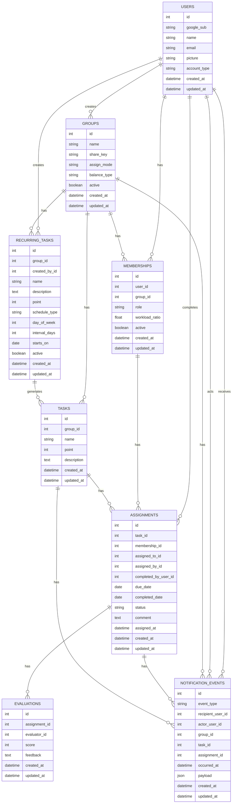

# KajiShare API

- グループ課題・家事・タスク管理のためのRails製APIサーバです。
- フロントエンド（React / Next.js など）からの利用を想定し、
  認証・権限・バリデーション・テストを重視した設計になっています。

## 特徴・設計方針

- API専用（Rails API mode）
- Bearer Token による認証
- 権限管理（admin / member）
- ワークロード比率による負荷管理
- バリデーションエラーの構造化レスポンス
- RSpecによるテスト（Request Spec中心）

## 主な機能

- Google認証 / ゲスト認証によるユーザー管理
- グループ・タスク・アサインメント・評価・定期タスクの REST API
- 権限（admin/member）・ワークロード比率管理
- 通知イベント（task_assigned / member_joined / task_evaluated）の取得
- JSONレスポンス / バリデーションエラーの詳細返却

## 技術スタック

- Ruby 3.4.4
- Rails 8.0.4（API mode）
- PostgreSQL 14.19
- RSpec 3.13
- FactoryBot, Shoulda Matchers
- Docker / docker-compose
- Google Auth（IDトークン認証）

## セットアップ手順

### 必要環境

- Ruby 3.4.4
- Rails 8.0.4
- PostgreSQL 14.19
- Node.js（フロント連携時のみ）

### 初期構築

```bash
git clone https://github.com/meeeee05/KajiShare-backend
cd KajiShare-backend
bundle install
rails db:create db:migrate db:seed
rails s
```

## 認証について

本APIは JWT（Bearer Token）認証 を採用しています。

Google OAuth 認証に成功すると、バックエンドからJWTトークンを発行します。

JWTトークンをAPIリクエストに付与してください。

Authorization: Bearer <token>

## APIエンドポイント（一部）

- `POST /api/v1/auth/google`
- `POST /api/v1/auth/guest`
- `POST /api/v1/groups/join`
- `GET/POST/PATCH/DELETE /api/v1/groups`
- `GET/POST /api/v1/groups/:group_id/tasks`
- `GET/PATCH/DELETE /api/v1/tasks/:id`
- `GET/POST/PATCH/DELETE /api/v1/assignments`
- `GET/POST/PATCH/DELETE /api/v1/evaluations`
- `GET/POST /api/v1/groups/:group_id/recurring_tasks`
- `GET/PATCH/DELETE /api/v1/recurring_tasks/:id`
- `GET /api/v1/notifications`

詳細は `API_ENDPOINTS.md` を参照してください。

## 通知APIメモ

- `GET /api/v1/notifications`
- `type=task_assigned` で task_assigned 通知のみ取得
- `for_records=true` で records モード応答（`mode=records`）
- `since_id` は数値または `task_assigned_123` のような形式に対応
- `limit` は `<=0` でデフォルト値（50）を使用

## タスク作成例

詳細は `API_ENDPOINTS.md` を参照

````json
POST /api/v1/groups/:group_id/tasks

{
  "task": {
    "name": "掃除",
    "description": "リビング掃除",
    "point": 5
  }
}

## テスト

RSpecによる自動テストを実装しています。

```bash
bundle exec rspec
````

- Request Specを中心に実施
- 認証（401）
- 権限（403）
- 存在しないリソース（404）
- バリデーションエラー（422）

## セキュリティ

本APIは Rails API モードで構築しており、
JavaScript 依存関係はフロントエンド側で管理しています。

## ディレクトリ構成（抜粋）

```text
app/
  controllers/
  models/
  serializers/

spec/
  requests/api/v1/
  models/
  support/
  factories/

config/
db/
```

## ER図


